# IP-LAB-ASSIGNMENT
**1. Develop a program to display grayscale image using read and write operation.**

Description:
Binary images: are images whose pixels have only two possible intensity values.
 Binary images are often produced by thresholding a grayscale or color image, in 
order to separate an object in the image from the background. The color of the object
 (usually white) is referred to as the foreground color. grayscale image:A grayscale 
(or graylevel) image is simply one in which the only colors are shades of gray.
Often, the grayscale intensity is stored as an 8-bit integer giving 256 possible 
different shades of gray from black to white. to read an image we use the function
 cv2.imread(). to save a image we use cv2.imwrite(). to destory all the windows().

```python
import cv2 as cv
import numpy as np
image=cv.imread('tulips.jpg')
image = cv.resize(image, (0, 0), None, .25, .25)
grey = cv.cvtColor(image, cv.COLOR_RGB2GRAY)
grey_3_channel = cv.cvtColor(grey, cv.COLOR_GRAY2BGR)
numpy_horizontal = np.hstack((image, grey_3_channel))
numpy_horizontal_concat = np.concatenate((image, grey_3_channel), axis=1)
cv.imshow('flowers', numpy_horizontal_concat)
cv.waitKey()
```

***output:***
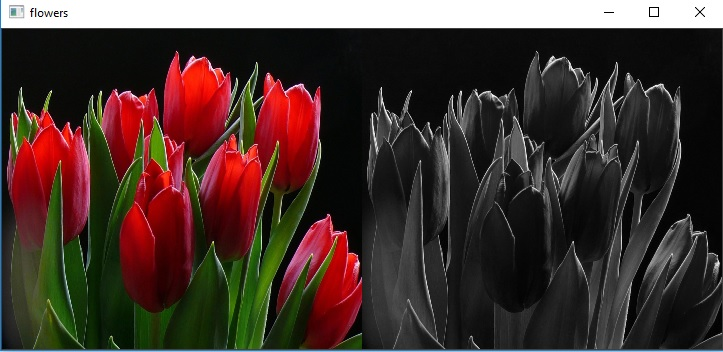

---
**2.Develop a program to perform linear transformations on an image: Scaling and Rotation**

Description:
Scaling is the procedure of measuring and assigning the objects to the numbers according to the specified
 rules. In other words, the process of locating the measured objects on the continuum, a continuous sequence
 of numbers to which the objects are assigned is called as scaling. cv2.resize() is uesd to resizes the given images.

```python
#scaling
import cv2 as cv
img=cv.imread("island.jpg")
cv.imshow('image',img)
res=cv.resize(img,(0,0),fx=0.50,fy=0.50)
cv.imshow("Result",res)
cv.waitKey(0)
cv.destroyAllWindows(0)
```
***output:***


---
```python
#rotation
import cv2 
import numpy as np 
FILE_NAME = 'flower.jpg'
img = cv2.imread(FILE_NAME) 
(rows, cols) = img.shape[:2] 
M = cv2.getRotationMatrix2D((cols / 2, rows / 2), 45, 1) 
res = cv2.warpAffine(img, M, (cols, rows)) 
cv2.imshow('result.jpg', res) 
cv2.waitKey(0)
```
***output:***

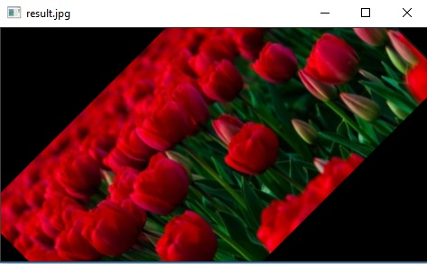


---
**3. Develop a program to find the sum and mean of a set of images. 
     Create ‘n’ number of images and read them from the directory and perform the operations.**

Description:
img.append is uesd to append all the images together Adding Images To add two images or add a
 constant value to an image. • [imadd] function adds the value of each pixel in one of the input 
images with the corresponding pixel in the other input image and returns the sum in the corresponding 
pixel of the output image.

```python

#sum & Mean
import os
path=r'D:\new'
imgs=[]
files=os.listdir(path) #List
for file in files:
    fpath=path+'\\'+file
    imgs.append(cv2.imread(fpath))
    
for i,im in enumerate(imgs):
    cv2.imshow(files[i],imgs[i])    
    cv2.imshow('Mean of '+files[i],len(im)/im)
print('sum of imgs(Total no) = ',i+1)    
cv2.waitKey(0)
cv2.destroyAllWindows()

```
```
sum of imgs(Total no) =  2
```
***output:***

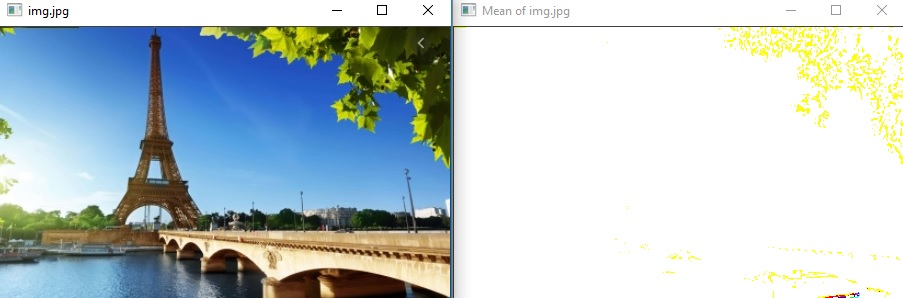


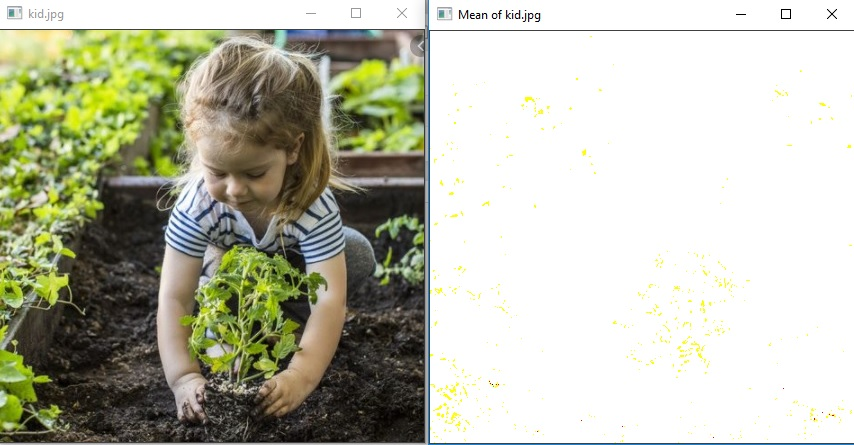

---
**4. Develop a program to convert the color image to gray scale and binary image**

Description:
Binary images: are images whose pixels have only two possible intensity values. 
Binary images are often produced by thresholding a grayscale or color image, in 
order to separate an object in the image from the background. The color of the 
object (usually white) is referred to as the foreground color.
Grayscale image:A grayscale (or graylevel) image is simply one in which the only
 colors are shades of gray. ... Often, the grayscale intensity is stored as an 8-bit 
integer giving 256 possible different shades of gray from black to white. 
threshold:Thresholding produces a binary image, where all pixels with intensities above 
(or below) a threshold value are turned on, while all other pixels are turned off.

```python

#gray image
import cv2 as cv
img = cv.imread("tea.jpg")
gray=cv.cvtColor(img,cv.COLOR_BGR2GRAY)
cv.imshow('Original',img)
cv.imshow("Gray Image",gray)
cv.waitKey(0)
cv.destroyAllWindows()
```
***output:***

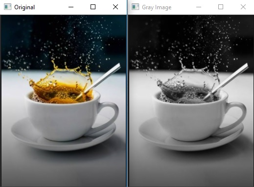

---


```python
#binary image
import cv2 as cv
img = cv.imread("tea.jpg")
ret, b_img = cv.threshold(img,127,255,cv.THRESH_BINARY)
cv2.imshow('Original',img)
cv.imshow("Binary Image",b_img)
cv.waitKey(0)
cv.destroyAllWindows()

```
***output:***

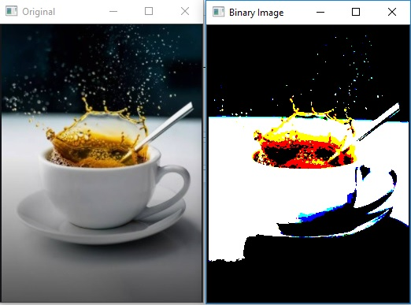

---
**5.	Develop a program to convert the given color image to different color spaces.**

DESCRIPTION:
A color space is a specific organization of colors. ... Adding a specific mapping function
 between a color model and a reference color space establishes within the reference color 
space a definite "footprint", known as a gamut , and for a given color model this defines 
a color space. COLOR_BGR2RGB is used to convert bgr image to RGB image COLOR_BGR2HSV is 
used to convert BGR image to HSV image COLOR_BGR2YCrCb is uesd to convert BGR image to 
YCrCb image

```python
import cv2
img=cv2.imread("img.jpg")
cv2.imshow("original",img)
cv2.waitKey(0)
#gray
gray=cv2.cvtColor(img,cv2.COLOR_BGR2GRAY)
cv2.imshow("GRAY image",gray)
cv2.waitKey(0)
#HSV
cv2.imshow('HSV',cv2.cvtColor(img, cv2.COLOR_BGR2HSV))
cv2.waitKey(0)
#lab
cv2.imshow('LAB',cv2.cvtColor(img, cv2.COLOR_BGR2LAB))
cv2.waitKey(0)
cv2.destroyAllWindows()

```
***output:***

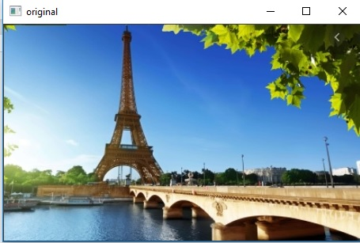

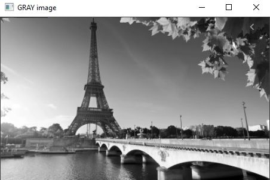

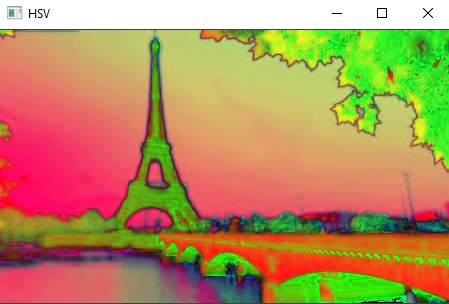

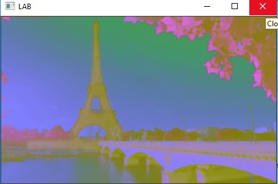

---

**6.	Develop a program to create an image from 2D array (generate an array of random size).**

Description:
An image is an array, or a matrix, of square pixels (picture elements) arranged in columns and rows.
An image — an array or a matrix of pixels arranged in columns and rows. In a (8-bit) greyscale image 
each picture element has an assigned intensity that ranges from 0 to 255. A 2D array has a type such 
as int[][] or String[][], with two pairs of square brackets. ... The elements of a 2D array are arranged 
in rows and columns, and the new operator for 2D arrays specifies both the number of rows and the number 
of columns. PIL: Python Imaging Library (abbreviated as PIL) (in newer versions known as Pillow) is a 
free and open-source additional library for the Python programming language that adds support for opening, 
manipulating, and saving many different image file formats. It is available for Windows, Mac OS X and Linux.

```python
import cv2
import numpy as np
#Random 2D Array
array_img=np.random.randint(255,size=(300,500),dtype=np.uint8)
cv2.imshow('arrayimage',array_img)
cv2.waitKey(0)
cv2.destroyAllWindows()

```
***output:***

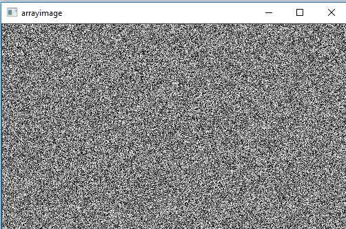

---

**7.  Find the sum of the neighborhood values of the matrix.**

```python

import numpy as np
M = [[1, 2, 3], [4, 5, 6], [7, 8, 9]]
M = np.asarray(M) N = np.zeros(M.shape)
def sumNeighbors(M,x,y): l = []
 for i in range(max(0,x-1),x+2): 
for j in range(max(0,y-1),y+2): 
try: t = M[i][j] l.append(t)
 except IndexError: 
pass return sum(l)-M[x][y]

for i in range(M.shape[0]): 
for j in range(M.shape[1]): 
N[i][j] = sumNeighbors(M, i, j)
print ("Original matrix:\n", M) 
print ("Summed neighbors matrix:\n", N)
```

***output:***

Original matrix: [[1 2 3] [4 5 6] [7 8 9]]
 Summed neighbors matrix: [[11. 19. 13.] [23. 40. 27.] [17. 31. 19.]]

---

**8.  Find the neighborhood values of the matrix.**

```python
import numpy as np
ini_array = np.array([[1, 2,5, 3], [4,5, 4, 7], [9, 6, 1,0]])
print("initial_array : ", str(ini_array));
def neighbors(radius, rowNumber, columnNumber):
    return[[ini_array[i][j]if i >= 0 and i < len(ini_array) and j >= 0 and j < len(ini_array[0]) else 0
            for j in range(columnNumber-1-radius, columnNumber+radius)]
           for i in range(rowNumber-1-radius, rowNumber+radius)]
neighbors(2, 2, 2)
```

***output:***
initial_array :  [[1 2 5 3]   [4 5 4 7]  [9 6 1 0]]


[[0, 0, 0, 0, 0],
 [0, 1, 2, 5, 3],
 [0, 4, 5, 4, 7],
 [0, 9, 6, 1, 0],
 [0, 0, 0, 0, 0]]
 
 ---

**9. operator overloading**

```cpp

#include <iostream.h>
using namespace std; 
class matrix 
{ 
int r1, c1, i, j, a1;
int a[10][10];
public:int get()
{ cout << "Enter the row and column size for the matrix\n";
cin >> r1;
cin >> c1; 
cout << "Enter the elements of the matrix\n"; 
for (i = 0; i < r1; i++) 
{
for (j = 0; j < c1; j++)
{ 
cin>>a[i][j];

} 
}

};
void operator+(matrix a1)
{
int c[i][j];

for (i = 0; i < r1; i++)
{
for (j = 0; j < c1; j++)
{ 
c[i][j] = a[i][j] + a1.a[i][j];
}

} 
cout<<"addition is\n"; 
for(i=0;i<r1;i++)
{
cout<<" "; 
for (j = 0; j < c1; j++)
{ 
cout<<c[i][j]<<"\t"; 
} 
cout<<"\n"; 
}

};

void operator-(matrix a2)
{ 
int c[i][j];

for (i = 0; i < r1; i++) 
{ 
for (j = 0; j < c1; j++) 
{ 
c[i][j] = a[i][j] - a2.a[i][j];
}

} 
cout<<"subtraction is\n";
for(i=0;i<r1;i++) 
{
cout<<" "; 
for (j = 0; j < c1; j++) 
{
cout<<c[i][j]<<"\t";
} 
cout<<"\n"; 
}
}
;
void operator*(matrix a3) 
{
int c[i][j];

for (i = 0; i < r1; i++)
{
for (j = 0; j < c1; j++)
{ 
c[i][j] =0;
for (int k = 0; k < r1; k++)
{
c[i][j] += a[i][k] * (a3.a[k][j]);
}
}
}
cout << "multiplication is\n";
for (i = 0; i < r1; i++) 
{ 
cout << " ";
for (j = 0; j < c1; j++) 
{
cout << c[i][j] << "\t"; 
} 
cout << "\n"; 
}
};

};

int main()
{
matrix p,q; 
p.get(); 
q.get();
p + q;
p - q; 
p * q;
return 0; 
}

```
**output:**

Enter the row and column size for the matrix 2 2 

Enter the elements of the matrix 6 7 8 9 

Enter the row and column size for the matrix 2 2

Enter the elements of the matrix 1 2 3 4 

addition is 7 9 11 13

subtraction is 5 5 5 5

multiplication is 27 40 35 52

---

 **10.  Develop a program to implement negative transformation**

```python

import cv2 
import numpy as np
image=cv2.imread("flower.jpg")
cv2.imshow("original",image)
cv2.waitKey(0)
img_neg=225-image
cv2.imshow("negativeimage",img_neg)
cv2.waitKey(0)
```
***output:***

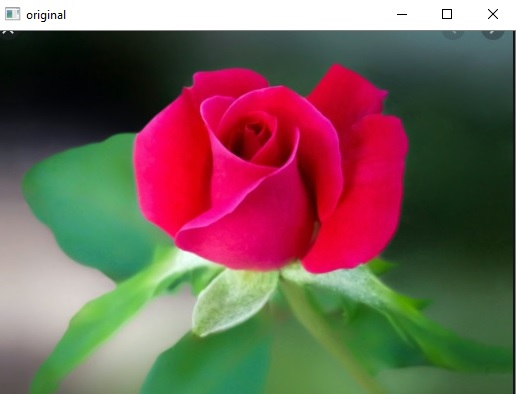
   
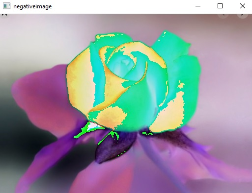  

---

 **11.  Develop a program to implement contrast transformation**

```python

from PIL import Image, ImageEnhance  
im = Image.open(r"nature.jpg")
im.show()
im3 = ImageEnhance.Color(im) 
im3.enhance(4.3).show()

```
***output:***


   
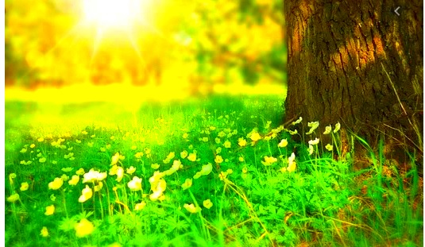  

---

**11.  Develop a program to implement threshold transformation of the image**

```python

# Python programe to illustrate 
# simple thresholding type on an image 
	
# organizing imports 
import cv2 
import numpy as np 

# path to input image is specified and 
# image is loaded with imread command 
image1 = cv2.imread('flower.jpg') 

# cv2.cvtColor is applied over the 
# image input with applied parameters 
# to convert the image in grayscale 
img = cv2.cvtColor(image1, cv2.COLOR_BGR2GRAY) 

# applying different thresholding 
# techniques on the input image 
# all pixels value above 120 will 
# be set to 255 
ret, thresh1 = cv2.threshold(img, 120, 255, cv2.THRESH_BINARY) 
ret, thresh2 = cv2.threshold(img, 120, 255, cv2.THRESH_BINARY_INV) 
ret, thresh3 = cv2.threshold(img, 120, 255, cv2.THRESH_TRUNC) 
ret, thresh4 = cv2.threshold(img, 120, 255, cv2.THRESH_TOZERO) 
ret, thresh5 = cv2.threshold(img, 120, 255, cv2.THRESH_TOZERO_INV) 

# the window showing output images 
# with the corresponding thresholding 
# techniques applied to the input images 
cv2.imshow('Binary Threshold', thresh1) 
cv2.imshow('Binary Threshold Inverted', thresh2) 
cv2.imshow('Truncated Threshold', thresh3) 
cv2.imshow('Set to 0', thresh4) 
cv2.imshow('Set to 0 Inverted', thresh5) 
	
# De-allocate any associated memory usage 
if cv2.waitKey(0) & 0xff == 27: 
	cv2.destroyAllWindows() 

```


***output:***

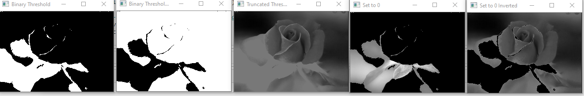

---

**12.  Develop a program to implement power law transformation**

```python

import cv2
import numpy as np
img = cv2.imread('flower.jpg')
cv2.imshow("original",img)
for gamma in [0.1, 0.5, 1.2, 2.2]:
    gamma_corrected = np.array(255*(img / 255) ** gamma, dtype='uint8')
    cv2.imshow('gamma_transformed'+str(gamma)+'.jpg', gamma_corrected)
cv2.waitKey(0)

```

***output:***


---
