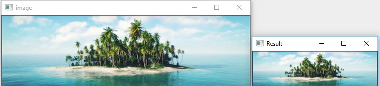

# IP-LAB-ASSIGNMENT
**1. Develop a program to display grayscale image using read and write operation.**
```python
import cv2 as cv
import numpy as np
image=cv.imread('tulips.jpg')
image = cv.resize(image, (0, 0), None, .25, .25)
grey = cv.cvtColor(image, cv.COLOR_RGB2GRAY)
grey_3_channel = cv.cvtColor(grey, cv.COLOR_GRAY2BGR)
numpy_horizontal = np.hstack((image, grey_3_channel))
numpy_horizontal_concat = np.concatenate((image, grey_3_channel), axis=1)
cv.imshow('flowers', numpy_horizontal_concat)
cv.waitKey()
```
***output:***


---
**2.Develop a program to perform linear transformations on an image: Scaling and Rotation**
```python

#scaling
import cv2 as cv
img=cv.imread("island.jpg")
cv.imshow('image',img)
res=cv.resize(img,(0,0),fx=0.50,fy=0.50)
cv.imshow("Result",res)
cv.waitKey(0)
cv.destroyAllWindows(0)
```
***output:***



---
```python
#rotation
import cv2 
import numpy as np 
FILE_NAME = 'flower.jpg'
img = cv2.imread(FILE_NAME) 
(rows, cols) = img.shape[:2] 
M = cv2.getRotationMatrix2D((cols / 2, rows / 2), 45, 1) 
res = cv2.warpAffine(img, M, (cols, rows)) 
cv2.imshow('result.jpg', res) 
cv2.waitKey(0)
```
***output:***


---

